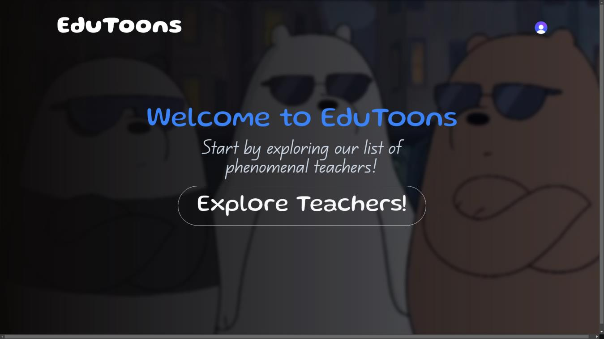
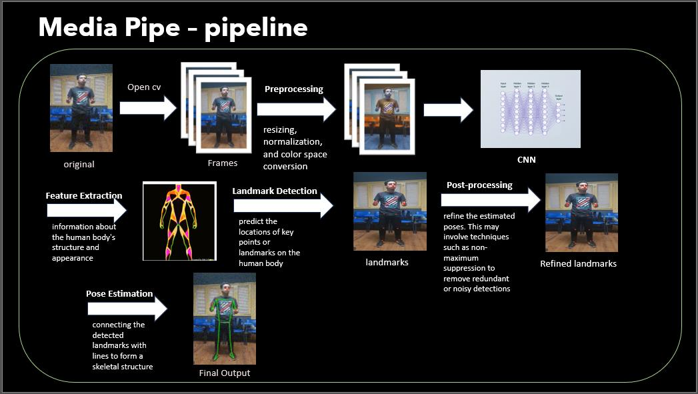
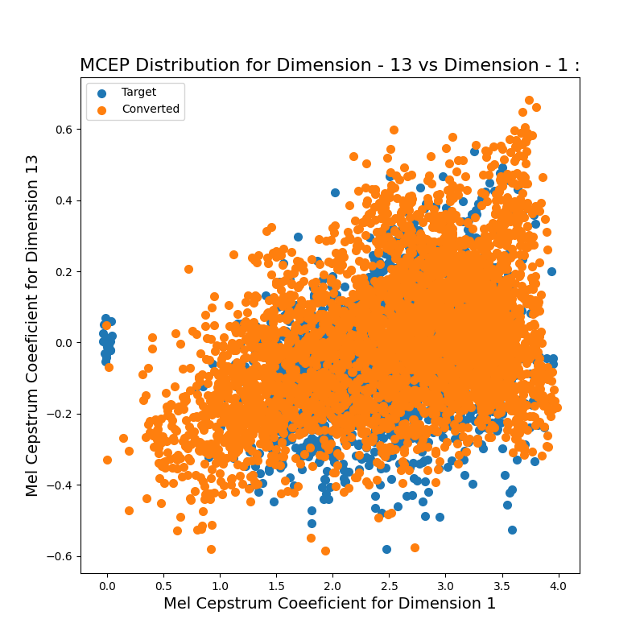
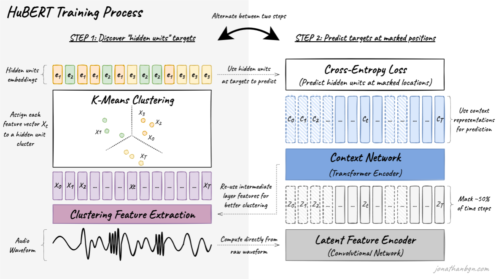

# EduToons: AI-Driven Educational Animation Platform



## Academic Research Project

EduToons is an innovative e-learning platform that transforms traditional teaching materials into engaging animated content using advanced AI technologies.
This research project addresses the challenge of maintaining young learners' interest in online education through the integration of voice cloning and animation technologies.

## 🎯 Research Objectives

- Develop an AI-driven system for creating interactive and engaging learning experiences
- Transform traditional teaching content into animated character-based lessons
- Implement voice cloning technology for authentic character voicing
- Create an interactive learning environment with real-time Q&A capabilities

## 🔬 Technical Implementation

### Voice Conversion System

- **RVC Model**: Utilizes Retrieval-based Voice Conversion for voice conversion
- **HuBERT Integration**: Implements Hidden-Unit BERT model for feature extraction
- **Performance Metrics**:
  - **Objective Metrics**:
    1. RMSE of log(f0) (logF0_RMSE)
    2. Mean MCEP
  - **Subjective Metrics**:
    1. Mean Opinion Score (MOS)

### Video Processing Pipeline



- **Motion Capture**: MediaPipe for pose estimation and landmark detection
- **3D Animation**: Blender integration for character rigging and animation
- **Character Rendering**: Custom pipeline for seamless character animation

### Web Platform Architecture

- **Frontend**: Next.js
- **Authentication**: Clerk.js
- **Database**: MySQL for data management
- **Backend**: Flask-based API services

## 📊 Experimental Results

### Dataset Characteristics

- Custom-created educational video dataset
- Duration: 10-20 seconds per video
- Focus on full-body visibility and simple movements
- Content: Educational lessons and stories for children

### Performance Evaluation

- **Does Animation Actually Help Children ?**:

  - **Survey**:
    Due to time constraints, we were unable to conduct an experimental study in local schools. Instead, we surveyed our siblings.
    Despite a potential bias, they responded enthusiastically to the concept of a cartoon character teaching and answering their questions.

- **Voice Conversion Quality**:
  

  - logF0_RMSE: 0.2
  - MOS scale (survey): 4.1
  - for more details on voice converion read [here](https://github.com/YoussefMohamedym3/voice-conversion-evaluation/blob/main/README.md).

## 🛠️ Technical Stack

### Voice Processing Tools



- Google Colab (Model Training)
- FFmpeg (Audio Processing)
- RVC (Voice COnversion/Cloning)
- huBERT (Feature Extraction)

### Animation Tools


- MediaPipe (Pose Detection)
- Blender (3D Animation)
- AccuRIG (Character Rigging)
- BlendArMocap (Motion Capture)

### Web Development

- Next.js (Frontend Framework)
- Tailwind CSS (Styling)
- Flask (Backend API)
- MySQL (Database)
- Git (Version Control)

## 🎓 Academic References

1. Xiao, L. "Animation Trends in Education." International Journal of Information and Education Technology
2. Hsu, W. et al. "HuBERT: Self-supervised speech representation learning by masked prediction of hidden units." IEEE/ACM transactions
3. Leng, Y. et al. "MBNet: MOS prediction for synthesized speech with mean-bias network." ICASSP 2021
4. Akhter, M. et al. "An analysis of performance evaluation metrics for voice conversion models." 2022 IEEE 19th India council international conference (INDICON). IEEE, 2022.

## 🔄 Future Development

1. **Platform Expansion**

   - Additional language support beyond Arabic and English
   - Enhanced interactive features
   - Integration with existing LMS platforms

2. **Technical Improvements**
   - Scalability optimization
   - Performance enhancements
   - Real-time processing capabilities

## 📝 Citation

If you use this work in your research, please cite:

```bibtex
@article{edutoons2024,
  title={EduToons: AI-Driven Educational Animation Platform},
  authors={[Mohamed Ashraf Mohamed,
            Mohamed Ashraf AbdElnabi,
            Youssef Mohamed AbdElaal,
            Youssef Shehata Shaaban,
            Saif Adel AbdElghany,
            Samy Ahmed Samy,
          ]},
  year={2024}
}
```

## 🤝 Acknowledgments

This research was conducted as part of a graduation project at Ain Shams University. Special thanks to the faculty advisors and research participants who contributed to this work.

## 📄 License

This project is licensed under the MIT License - see the [LICENSE](LICENSE) file for details.
